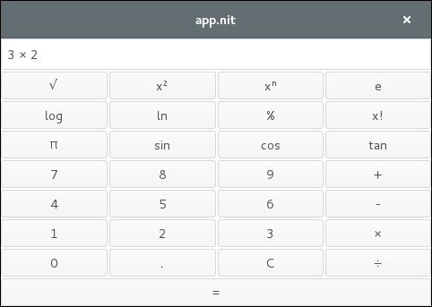
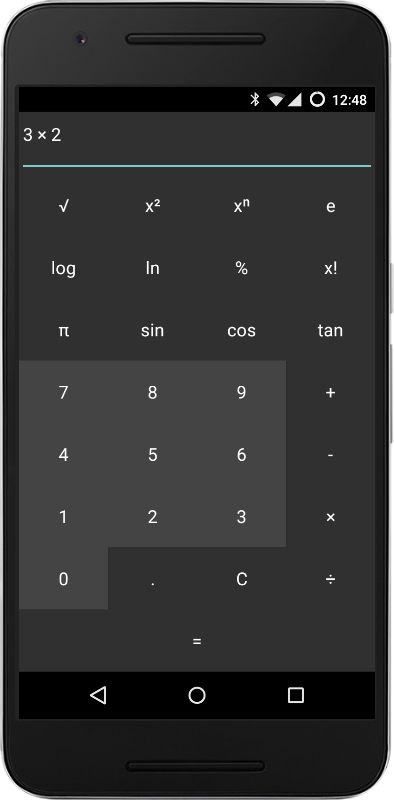
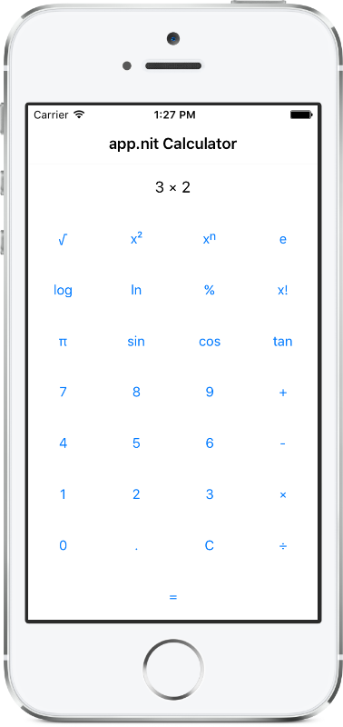

Portable calculator built using _app.nit_

# Project structure

* `calculator_logic` defines `CalculatorContext` with all the business logic of a calculator.
  It takes as input operations and numbers, and outputs the text to display.
* `calculator` implements the portable graphical interface using the _app.nit_ framework
* `scientific_calculator` refines `calculator` to add scientific operations.
* `android_calculator` refines `calculator` to get a nicer aesthetic on Android.
* `ios_calculator` refines `calculator` to get a nicer aesthetic on iOS.
* `calculator_test` test `CalculatorContext` as a black box.

# Compilation

* Compile and run on the desktop (GNU/Linux and OS X) with:

	~~~
	make
	bin/calculator
	~~~

* Compile for Android and install on a device or emulator with:

	~~~
	make bin/android.apk
	adb install -r bin/calculator.apk
	~~~

* Compile for iOS and run on the simulator with:

	~~~
	make bin/android.app
	ios-sim launch bin/calculator.app
	~~~

# Screenshots

